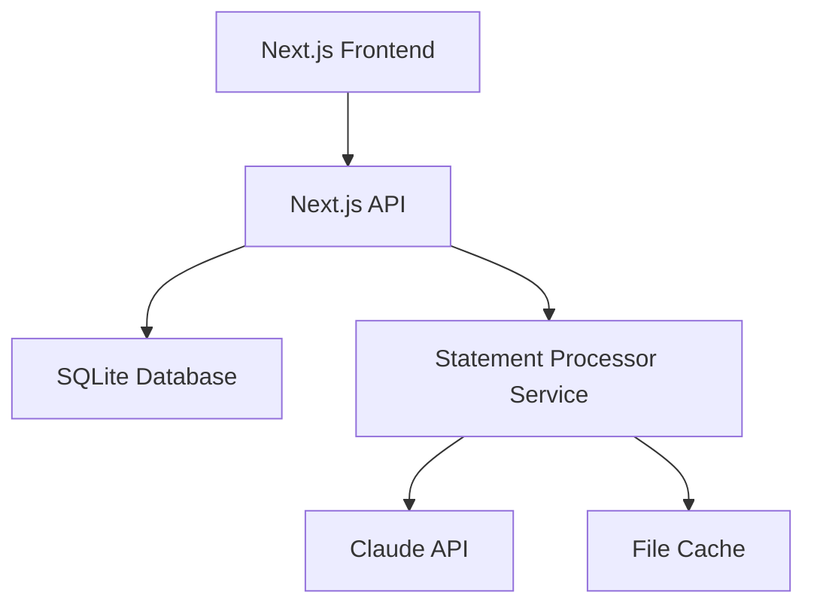

# Document AI - Bank Statement Analyzer

A comprehensive solution for analyzing bank statements using AI, built with Next.js and Claude API.

## Project Structure

This project consists of two main components:

1. **Main Application** (Next.js) - The web interface for managing cards and viewing analytics
2. **Bank Statement Processor** (Node.js) - Standalone service for processing PDFs with Claude API

```
document-ai/
├── src/                    # Next.js application source
├── prisma/                 # Database schema and migrations
├── bank-statement-processor/  # PDF processing service
└── public/                 # Static assets
```

## Features

### Main Application
- 📊 Analytics dashboard with spending insights
- 💳 Credit/debit card management
- 📄 Statement upload and processing
- 🔔 Real-time notifications
- 📈 Spending trends and categorization

### Statement Processor
- 🤖 Claude 3.5 Sonnet integration for intelligent PDF processing
- 📄 PDF to image conversion for vision analysis
- 💾 Caching to avoid reprocessing
- 🔄 Automatic retry with rate limit handling
- 🔐 API key authentication

## Setup

### Prerequisites
- Node.js 18+
- npm or yarn
- SQLite (for development)
- Anthropic API key

### Installation

1. Clone the repository:
```bash
git clone https://github.com/yourusername/document-ai.git
cd document-ai
```

2. Install dependencies:
```bash
# Main application
npm install

# Statement processor
cd bank-statement-processor
npm install
cd ..
```

3. Set up environment variables:
```bash
cp .env.example .env
# Edit .env with your API keys and configuration
```

4. Set up the database:
```bash
npm run db:migrate
npm run db:generate
```

### Running the Application

1. Start the statement processor service:
```bash
cd bank-statement-processor
npm run dev
```

2. In a new terminal, start the main application:
```bash
npm run dev
```

3. Access the application at `http://localhost:3000`

## Environment Variables

Key environment variables (see `.env.example` for full list):

- `DATABASE_URL` - SQLite database path
- `ANTHROPIC_API_KEY` - Claude API key
- `NEXT_PUBLIC_PROCESSOR_API_URL` - Statement processor URL
- `NEXT_PUBLIC_PROCESSOR_API_KEY` - Processor service API key

## API Endpoints

### Main Application
- `GET /api/cards` - Get all cards
- `POST /api/cards` - Create a new card
- `POST /api/statements/upload` - Upload a statement
- `POST /api/statements/[id]/process` - Process a statement
- `GET /api/notifications` - Get user notifications

### Statement Processor
- `GET /api/health` - Health check
- `POST /api/process` - Process a PDF statement

## Architecture



## Development

### Running Tests
```bash
# Main application
npm test

# Statement processor
cd bank-statement-processor
npm test
```

### Building for Production
```bash
# Main application
npm run build

# Statement processor
cd bank-statement-processor
npm run build
```

### Docker Deployment
```bash
# Build and run with Docker Compose
docker-compose up --build
```

## Security Considerations

- API key authentication for all services
- Rate limiting on API endpoints
- Secure file handling (in-memory processing)
- Input validation and sanitization
- CORS and security headers

## Future Improvements

1. **Enhanced PDF Processing**
   - Implement proper PDF to image conversion
   - Add OCR for scanned documents
   - Support for multiple bank formats

2. **Authentication & Authorization**
   - User authentication system
   - Role-based access control
   - Multi-tenant support

3. **Advanced Analytics**
   - Machine learning for categorization
   - Spending predictions
   - Budget recommendations

4. **Infrastructure**
   - Redis for distributed caching
   - S3 for document storage
   - Kubernetes deployment

## Contributing

1. Fork the repository
2. Create your feature branch (`git checkout -b feature/amazing-feature`)
3. Commit your changes (`git commit -m 'Add some amazing feature'`)
4. Push to the branch (`git push origin feature/amazing-feature`)
5. Open a Pull Request

## License

MIT License - see LICENSE file for details

## Support

For issues and questions:
- Create an issue on GitHub
- Check existing documentation
- Review closed issues for solutions